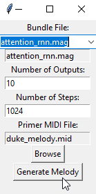

# magenta_generator

Magenta Melody Generator

Wrapper user interface that executes a command line interface generating midi files based on a primer midi using the melody_rnn model (part of the Magenta library).
Code partially generated by ChatGPT.

The objective was to simplify my life for melody generation on the fly. This is work in progress.

Configure default values in config.ini, execute code to launch the interface.

Pre-requesite: having downloaded magenta checkpoints (and placed in default ./checkpoints folder or other folder specified in config.ini)
https://github.com/magenta/magenta-js/blob/master/music/checkpoints/README.md

